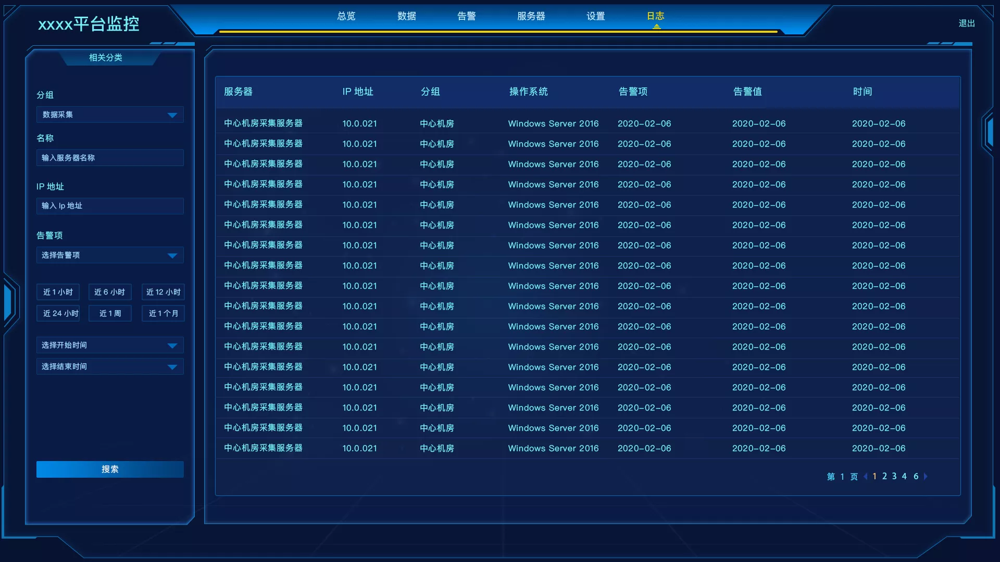

### 需求


要开发这样一个页面。其难点在于同时实现左上，右下斜切角，显示边框，显示内阴影。刚开始是想用纯 css 实现，但是没有找到特别好的方法。最后是利用 css3 设置多背景图的方式实现的。具体实现代码如下：

```
background: url("../../../assets/images/left_pic_top.png") 0 0
    no-repeat,
url("../../../assets/images/left_pic_bottom.png") 0 20px no-repeat,
url("../../../assets/images/left_pic_centre.png") 0 100% no-repeat;
background-size: 100% 20px, 100% calc(100% - 40px), 100% 20px;
```
